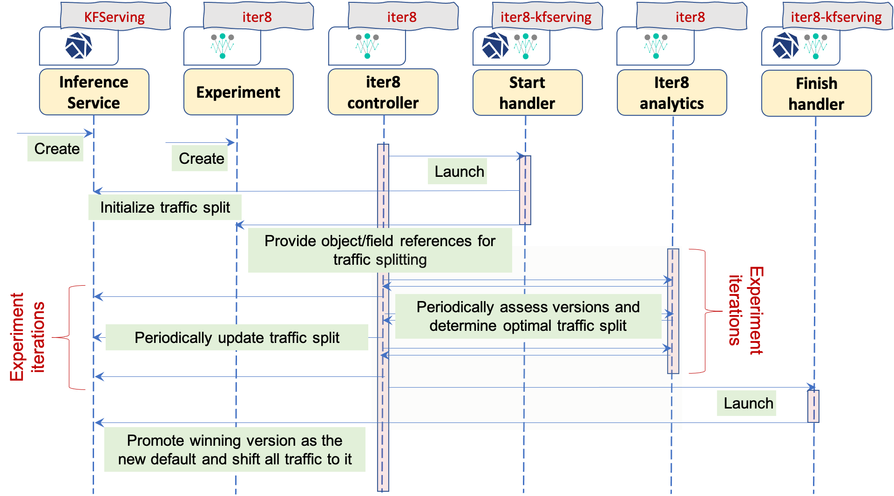

## Under the Hood

The following sequence diagram provides an overview of the various components involved in an iter8-kfserving experiment, and their interactions.

### Explanation of Concepts

**InferenceService:** Kubernetes custom resource defined by KFServing. InferenceService object specifies the split of traffic between different model versions. Here is [an example](https://github.com/iter8-tools/iter8-kfserving/blob/main/samples/common/sklearn-iris.yaml).

**Experiment:** Kubernetes custom resource defined by iter8. You can declaratively configure a variety of metrics-driven live experiments such as automated progressive canary rollouts, automated progressive A/B or A/B/n rollouts, and performance tests using Experiment objects. Here is [an example](https://github.com/iter8-tools/iter8-kfserving/blob/main/samples/experiments/example1.yaml).

**iter8-controller:** Iter8's Golang-based etc3 controller (Extensible Thin Controller with Composable CRD). The iter8-controller provides core capabilities for orchestrating live experiments over different Kubernetes and OpenShift stacks.

**Start handler:** An executable that is packaged within a container image and launched by iter8-controller at the start of an experiment as a Kubernetes job. Start handler can be written in any language: for example, the [iter8-kfserving start handler](https://github.com/iter8-tools/iter8-kfserving/blob/main/handlers/start.sh) is implemented as a simple bash script.  The primary function of the start handler is to enhance the Experiment object at the start of an experiment with relevant object/field references. The iter8-controller uses these object/field references for splitting traffic during the experiment. As a secondary function, start handlers may also perform other initialization tasks such as setting an initial traffic split.

**iter8-analytics:** Iter8's Python-based analytics service which implements online Bayesian learning and estimation algorithms for evaluating versions, and implements multi-armed bandit algorithms for determining the optimal traffic split between versions in each iteration.

**Finish handler:** An executable that is packaged within a container image and launched by iter8-controller at the end of an experiment as a Kubernetes job. Finish handler can be written in any language: for example, [the iter8-kfserving finish handler](https://github.com/iter8-tools/iter8-kfserving/blob/main/handlers/finish.sh) is implemented as a simple bash script. The primary function of the finish handler is to promote the winning version in an experiment, so that it may receive all the traffic. As a secondary function, finish handlers may also perform other cleanup tasks.
